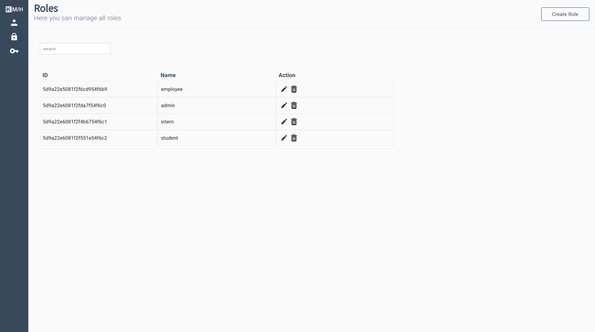

[![Issues][issues-shield]][issues-url]
[![MIT License][license-shield]][license-url]


<br />
<p align="center">
  <a href="https://github.com/LeonErath/interview-project-vue">
    
  </a>

  <h3 align="center">Vue Interview Project</h3>

  <p align="center">
    Development of a „User Management“ REST service with underlying data model and a simple VueJS-Frontend
  </p>
</p>


<!-- ABOUT THE PROJECT -->
## About The Project

 


### Built With

* [Nuxt.js](https://nuxtjs.org/)
* [Express.js](https://expressjs.com/)
* [MongoDB](https://www.mongodb.com/)


<!-- GETTING STARTED -->
## Getting Started

To get a local copy up and running follow these simple steps.

### Prerequisites

* npm
* docker-compose

### Installation
 
1. Clone the repo
```sh
git clone https:://github.com/LeonErath/repo.git
```
2. Install NPM packages of the frontend
```sh
cd frontend/
npm install
```
3. Install NPM packages of the backend
```sh
cd backend/
npm install
```

### Development
 
To setup the local development enviroment follow these steps:
1. docker-compose
```sh
docker-compose up --build
```


<!-- LICENSE -->
## License

Distributed under the MIT License. See `LICENSE` for more information.


<!-- CONTACT -->
## Contact

Leon Erath- [@leonerath](https://twitter.com/leonerath) - leon-erath@hotmail.de

Project Link: [https://github.com/LeonErath/interview-project-vue](https://github.com/LeonErath/interview-project-vue)


[issues-shield]: https://img.shields.io/github/issues/LeonErath/interview-project-vue?style=flat-square
[issues-url]: https://github.com/LeonErath/interview-project-vue/issues
[license-shield]: https://img.shields.io/github/license/LeonErath/interview-project-vue?style=flat-square
[license-url]: https://github.com/LeonErath/interview-project-vue/blob/master/LICENSE
[product-screenshot]: images/screenshot.png

