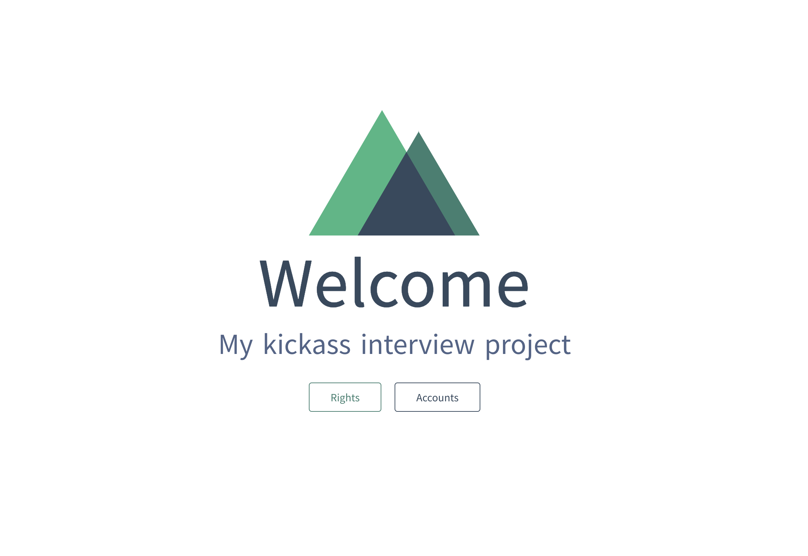

[![Issues][issues-shield]][https://github.com/LeonErath/interview-project-vue/issues]
[![MIT License][license-shield]][[license-url](https://github.com/LeonErath/interview-project-vue/blob/master/LICENSE)]


<br />
<p align="center">
  <a href="https://github.com/LeonErath/interview-project-vue">
    
  </a>

  <h3 align="center">Vue Interview Project</h3>

  <p align="center">
    Development of a „User Management“ REST service with underlying data model and a simple VueJS-Frontend
    <br />
    <a href="https://github.com/LeonErath/interview-project-vue"><strong>Explore the docs »</strong></a>
    <br />
    <br />
    <a href="https://github.com/LeonErath/interview-project-vue">View Demo</a>
    ·
    <a href="https://github.com/LeonErath/interview-project-vue/issues">Report Bug</a>
    ·
    <a href="https://github.com/LeonErath/interview-project-vue/issues">Request Feature</a>
  </p>
</p>


<!-- TABLE OF CONTENTS -->
## Table of Contents

- [Table of Contents](#table-of-contents)
- [About The Project](#about-the-project)
  - [Built With](#built-with)
- [Getting Started](#getting-started)
  - [Prerequisites](#prerequisites)
  - [Installation](#installation)
  - [Development](#development)
- [Usage](#usage)
- [Roadmap](#roadmap)
- [Contributing](#contributing)
- [License](#license)
- [Contact](#contact)


<!-- ABOUT THE PROJECT -->
## About The Project

 


### Built With

* [Nuxt.js](https://nuxtjs.org/)
* [Express.js](https://expressjs.com/)
* [MongoDB](https://www.mongodb.com/)


<!-- GETTING STARTED -->
## Getting Started

To get a local copy up and running follow these simple steps.

### Prerequisites

This is an example of how to list things you need to use the software and how to install them.
* npm
```sh
npm install npm@latest -g
```

OR
* docker-compose
```sh
brew install docker
```

### Installation
 
1. Clone the repo
```sh
git clone https:://github.com/LeonErath/repo.git
```
2. Install NPM packages of the frontend
```sh
cd frontend/
npm install
```
3. Install NPM packages of the backend
```sh
cd backend/
npm install
```

### Development
 
There are two ways of setting up a local development enviroment:
1. npm
```sh
cd frontend/
npm run dev
```
```sh
cd backend/
npm run dev
```
2. docker-compose
```sh
docker-compose up --build
```

<!-- USAGE EXAMPLES -->
## Usage

Use this space to show useful examples of how a project can be used. Additional screenshots, code examples and demos work well in this space. You may also link to more resources.

_For more examples, please refer to the [Documentation](https://example.com)_


<!-- ROADMAP -->
## Roadmap

See the [open issues](https://github.com/LeonErath/interview-project-vue/issues) for a list of proposed features (and known issues).


<!-- CONTRIBUTING -->
## Contributing

Contributions are what make the open source community such an amazing place to be learn, inspire, and create. Any contributions you make are **greatly appreciated**.

1. Fork the Project
2. Create your Feature Branch (`git checkout -b feature/AmazingFeature`)
3. Commit your Changes (`git commit -m 'Add some AmazingFeature'`)
4. Push to the Branch (`git push origin feature/AmazingFeature`)
5. Open a Pull Request


<!-- LICENSE -->
## License

Distributed under the MIT License. See `LICENSE` for more information.


<!-- CONTACT -->
## Contact

Leon Erath- [@twitter_handle](https://twitter.com/leonerath) - leon-erath@hotmail.de

Project Link: [https://github.com/LeonErath/interview-project-vue](https://github.com/LeonErath/interview-project-vue)


